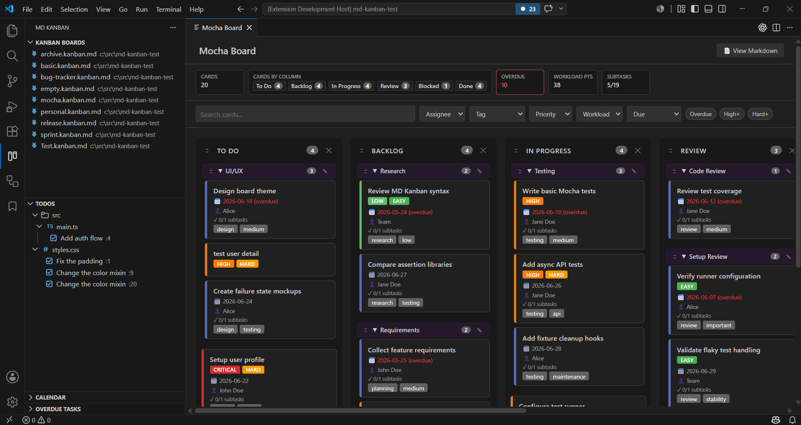
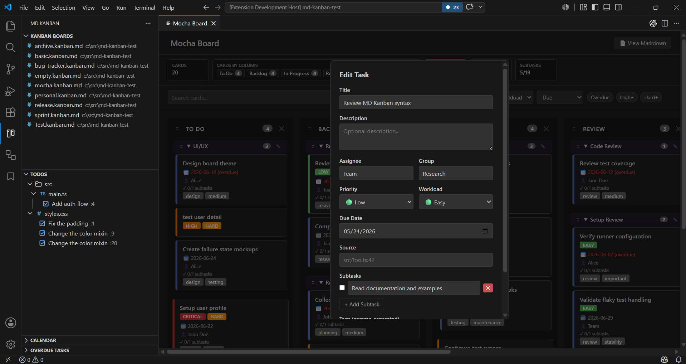
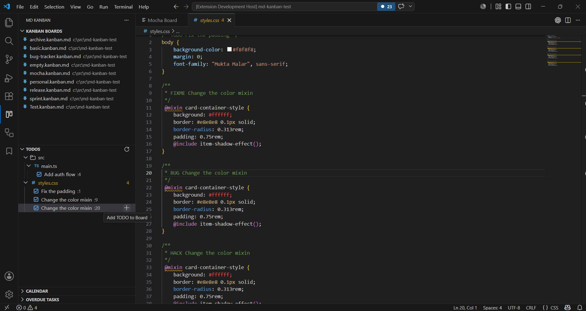
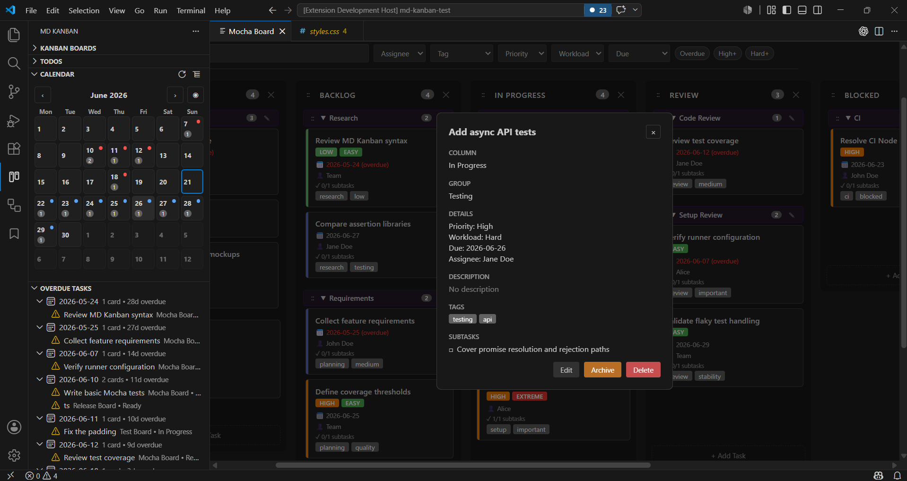
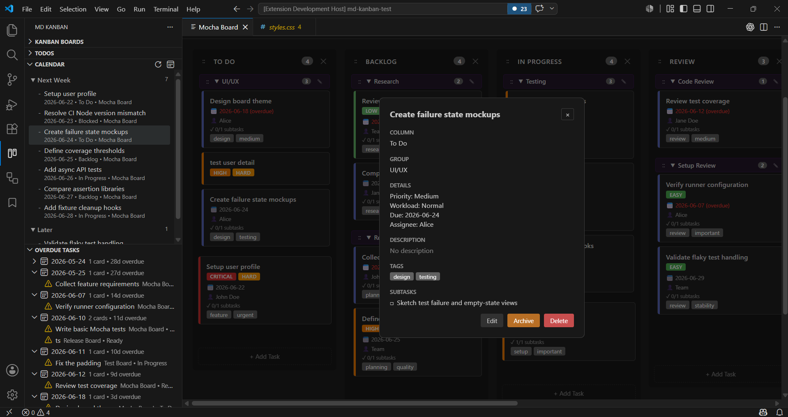

# MD Kanban JP

MD Kanban JP は、タスクを見やすいカンバンボードで管理しながら、データの本体はプレーンな Markdown に保つ VS Code 拡張機能です。

コードと一緒に置ける軽量なプロジェクトボードが欲しい、Git と相性よく使いたい、外部サービスに登録せず使いたい——そんなときに向いています。

> 本拡張機能は [jebakumarj/md-kanban](https://github.com/jebakumarj/md-kanban) を日本語化・汎用化したフォークです。


## スクリーンショット

### ボードビュー



### タスクの追加



### TODO ビュー



### カレンダー・期限超過ビュー



### タイムラインビュー



## MD Kanban JP の特長

- **ローカルファースト** — ボードはワークスペース内の `.kanban.md` / `kanban.md` ファイルに保存されます。
- **Git フレンドリー** — タスクは読みやすい Markdown なので、変更のレビュー・差分・バージョン管理ができます。
- **外部アカウント不要** — 別サービスにサインインせずにカンバンを使えます。
- **見た目でも、テキストでも** — ボードUIで編集しても、Markdown を直接開いても構いません。
- **エディタから離れない** — VS Code のアクティビティバーからボード・ソースTODO・期限超過カードを扱えます。

## 主な機能

- `.kanban.md` / `kanban.md` ファイル用のカンバンボードUI。
- ボード・TODO・期限超過タスク・カレンダーのセクションを持つアクティビティバービュー。
- 1ワークスペースに複数ボード。すべての `*.kanban.md` / `kanban.md` がサイドパネルに並びます。
- ボードテンプレート: 空のボード / 基本 / プロジェクト / チェックリスト / イベント・企画 / 個人用。
- カードのテキスト・担当者・タグ・優先度・作業量・期限日での絞り込みと検索。
- 統計バー(カード数、列ごとのカード数、期限超過、作業量ポイント、サブタスク進捗)。
- 期限超過タスクのサイドパネルビュー。
- カレンダーのサイドパネルビュー(月グリッド、日付ドット、件数、折りたたみ可能なタイムラインツリー)。
- カードを `archive.kanban.md` へ個別アーカイブ。
- 列内・列間・グループへの出入り・列末尾へのドラッグ&ドロップ。
- 落下位置を示すドロップインジケーター。
- Markdown の `###` 見出しに対応する折りたたみ可能なタスクグループ。
- グループ名の変更(グループ内の全カードをまとめて更新)、グループごとのドラッグ移動。
- 列の追加・名前変更・並べ替え・削除。
- タスク項目: 説明・タグ・優先度・作業量・期限日・担当者・サブタスク。
- タスクテンプレート(会議・プロジェクト・用事など)でカードをすばやく作成。
- 設定したコメントキーワード(`TODO`、`FIXME`、`BUG`、`HACK`、`NOTE` など)を集めるエクスプローラ風の TODO ツリー。
- ソースTODOコメントを、ソースファイルと行の情報付きでカードとしてボードに追加。
- 優先度ストリップ、作業量バッジ、期限超過ハイライト、サブタスク進捗表示。
- VS Code テーマ連携。
- ボード外での変更を検知するファイルウォッチ。
- 生の Markdown を横に並べて表示。

## インストール

### VSIX から

パッケージ化した `.vsix` ファイルがある場合:

1. VS Code を開く。
2. **拡張機能: VSIX からのインストール...** を実行。
3. `.vsix` ファイルを選択。

### ソースから

[開発セットアップ](#開発セットアップ)を参照してください。

## クイックスタート

1. アクティビティバーの **MD Kanban JP** アイコンを開く。
2. **カンバンボード** セクションで **新しいカンバンボードを作成** をクリック。
3. ボード名を入力し、テンプレートを選択。ワークスペースに `.kanban.md` ファイルが作成されます。
4. サイドパネルのボードをクリックして開く。
5. タスクを追加し、カードをドラッグして動かす。

| コマンド | 説明 |
| --- | --- |
| `カンバン: 新しいカンバンボードを作成` | テンプレートから新しい `.kanban.md` を作成 |
| `カンバン: カンバンボードを開く` | 既存のボードファイルを選んで開く |
| `カンバン: カンバンボードを更新` | サイドパネルのボード一覧を更新 |
| `カンバン: TODOを更新` | サイドパネルのソースTODO一覧を更新 |
| `カンバン: 期限超過タスクを表示` | 期限超過タスクビューにフォーカス |
| `カンバン: 期限超過タスクを更新` | 期限超過カードを更新 |
| `カンバン: タイムラインを表示` | カレンダービュー内のタイムラインツリーを表示 |
| `カンバン: タイムラインを更新` | タイムラインの今後の期限カードを更新 |
| `カンバン: カレンダーを表示` | カレンダービューにフォーカス |
| `カンバン: カレンダーを更新` | 日付付きカードを更新 |

1ワークスペースに複数のボードを置けます。`frontend.kanban.md`、`backend.kanban.md` などは別々のボードとして一覧に表示されます。

ボードファイルはエクスプローラやエディタタブの右クリックメニューにも **カンバンボードを開く** アクションがあります。TODO 項目には TODO サイドパネル内にインラインの追加アイコンがあります。

## ボードの使い方

### タスク

- 列内の **+ タスクを追加** でカードを作成します。
- タスクテンプレートを選ぶと、タイトル・タグ・優先度・作業量・担当者・サブタスクがあらかじめ入ります。
- カードをクリックすると編集画面が直接開きます。編集画面の左下に **削除** と **アーカイブ**(対応ボードのみ)ボタンがあります。
- 削除・アーカイブは確認ダイアログを挟み、その操作について「今後確認しない」を選べます。
- カードにマウスを重ねると、編集・アーカイブ・削除・ソースを開く のクイックボタンが右上に表示されます。
- ソース情報を持つカードは、参照先のファイルと行を開くソースボタンを表示します(ソース情報は TODO からのカード化時に付与され、編集しても保持されます)。
- カードをドラッグして並べ替えたり、列やグループの間を移動できます。
- 青い破線のドロップインジケーターで落下位置を確認できます。

### キーボード操作

マウスを使わずにカードを操作できます。カードは Tab でフォーカスできます。

| キー | 操作 |
| --- | --- |
| `Enter` / `Space` | フォーカス中のカードの編集画面を開く |
| `Ctrl+Enter`(Mac は `Cmd+Enter`) | 編集画面で保存 |
| `Escape` | モーダルを閉じる |
| `↑` / `↓` | 同じ列の前後のカードへフォーカス移動 |
| `←` / `→` | 隣の列のカードへフォーカス移動 |
| `Ctrl+↑` / `Ctrl+↓` | フォーカス中のカードを列内で並べ替え |
| `Ctrl+←` / `Ctrl+→` | フォーカス中のカードを隣の列へ移動 |
| `n` | フォーカス中のカードの列に新しいタスクを追加 |

### 統計と絞り込み

- 統計バーで、総カード数・列ごとの件数チップ・期限超過・作業量ポイント・完了サブタスクを一目で把握できます。
- 作業量ポイントは見積もりの目安です: 簡単 = 1、普通 = 2、難しい = 3、非常に困難 = 5。
- 絞り込みバーでカードのテキスト検索と、担当者・タグ・優先度・作業量・期限での絞り込みができます。
- 「期限超過」「高優先度以上」「高負荷以上」のクイックチップがあります。
- 「クリア」で絞り込みを解除して全体表示に戻ります。

### 期限超過タスク

- **期限超過タスク** ビューは、期限超過カードを期限日ごとにまとめて表示します。
- カードの `due` が今日より前だと期限超過になります。
- 完了扱いの列はスキップされます。既定の完了列パターンは `完了`、`クローズ`、`リリース済み`、`アーカイブ済み`、`Done`、`Closed`、`Shipped`、`Archived` です。
- 完了列名のパターンは `mdKanbanJp.completedColumnGlobs` で設定できます(`*` と `?` のワイルドカード対応)。
- 期限超過カードをクリックすると、そのカンバンボードを開いてカードの詳細を表示します。

設定例:

```json
{
  "mdKanbanJp.completedColumnGlobs": ["完了", "クローズ", "Done", "リリース済み *"]
}
```

プロジェクトに `.vscode/settings.json` を追加してください。

### カレンダー

- **カレンダー** ビューは日付付きの月グリッドを表示します。
- 日付セルには日付・ドット・件数を表示し、期限超過を含む日は警告色のドットになります。
- 日付セルをクリックすると、その日の最初のカードをカンバンボードで開いて詳細を表示します。
- 前月・次月・今日(丸アイコン)ボタンで月を移動できます。
- 更新の隣の切り替えボタンで、カレンダーとタイムラインを切り替えられます。
- タイムラインは今後のカードを `今日` / `今週` / `来週` / `今後` の折りたたみグループで表示します。
- `今週` と `来週` は月曜始まりのカレンダー週です。
- 期限超過カードはタイムラインではなく **期限超過タスク** ビューに残ります。
- 完了扱いの列は、期限超過・タイムラインと同じ `mdKanbanJp.completedColumnGlobs` 設定でスキップされます。

### グループ

- `###` 見出しの下のタスクはそのグループに属します。
- グループヘッダーをクリックで折りたたみ/展開します。
- グループの編集アイコンで名前を変更します。
- グループのドラッグハンドル(`::`)でグループごと移動します。
- カードをグループにドロップすると割り当てられます。
- 未グループ領域や列末尾にドロップするとグループから外れます。

### 列

- ボード作成時にテンプレート(空のボード / 基本 / プロジェクト / チェックリスト / イベント・企画 / 個人用)を選びます。
- 「空のボード」は列のない空のボードを作成します。**+ 列を追加** で自分で組み立てます。
- **+ 列を追加** で列を作成します。
- 列タイトルをクリックで名前を変更します。
- 列のドラッグハンドル(`::`)で並べ替えます。
- 削除アイコンで列とそのタスクを削除します。

### 既定のテンプレート

ボードテンプレートは新しい `.kanban.md` の初期列を定義します:

| テンプレート | 既定の列 |
| --- | --- |
| 空のボード | 列なし |
| 基本 | `未着手`、`進行中`、`完了` |
| プロジェクト | `バックログ`、`計画中`、`進行中`、`レビュー`、`完了` |
| チェックリスト | `未対応`、`対応中`、`確認待ち`、`完了` |
| イベント・企画 | `アイデア`、`準備中`、`実施待ち`、`完了` |
| 個人用 | `今日`、`今週`、`保留中`、`完了` |

タスクテンプレートはカード追加時に共通項目をあらかじめ入力します:

| テンプレート | タイトル | タグ | 優先度 | 作業量 | 既定のサブタスク |
| --- | --- | --- | --- | --- | --- |
| 空白 | なし | なし | `medium` | `normal` | なし |
| 会議 | `会議` | `会議` | `medium` | `easy` | アジェンダを準備する / 議事録を取る / 決定事項とToDoを共有する |
| プロジェクト | `プロジェクト項目` | `プロジェクト` | `medium` | `hard` | ゴールを定義する / 作業を分解する / 期限と担当を決める |
| 用事 | `用事` | `用事` | `medium` | `easy` | 必要なものを準備する / 実行する |
| 個人 | `個人タスク` | `personal` | `medium` | `easy` | 次のアクションを決める |

### Markdown ビュー

- **Markdownを表示** で、ボードファイルの生テキストをボードの横に開きます。
- Markdown を手で編集すると、ファイル変更を検知してボードに反映されます。

### アーカイブ

- カードやカードのクイックボタンのアーカイブから、そのカードを `archive.kanban.md` へ移動します。
- ボードの隣に `archive.kanban.md` が無ければ自動作成します。
- 既にあれば追記更新します。
- アーカイブされたカードは、元ボードのファイル名(例 `plan.kanban.md`)を名前にした列に追加されます。
- アーカイブ後、元ボードからそのカードは取り除かれます。
- `archive.kanban.md` 内のカードは再アーカイブできません。アーカイブボードを開いて確認・削除してください。

### TODO

- サイドパネルの **TODO** セクションは、設定したコメントキーワードをワークスペースから収集します。
- TODO はフォルダとファイルでまとめられ、エクスプローラのように展開・折りたたみできます。
- TODO 項目をクリックすると、該当行でソースファイルを開きます。
- 追加アイコンをクリックすると、カンバンカードとして追加できます。
- 対象ボードと列を選ぶと、TODO のタイトル・`todo` タグ・`source` メタデータ・バックリンク・元のTODOテキストを持つカードが作られます。
- TODO は `.kanban.md` ボードとは別です。元のソースコメントを編集・削除して更新します。
- 対象ファイルとキーワードは `mdKanbanJp.todoInclude`、`mdKanbanJp.todoExclude`、`mdKanbanJp.todoKeywords` で設定します。

対応する TODO コメントの書き方:

```ts
// TODO バリデーションを追加
// FIXME リトライ失敗の処理
// BUG フィルタリセット後の合計が誤り
// HACK 一時的なパーサのフォールバックを削除
// NOTE リリースチェックリストを記載
/* TODO バリデーションを追加 */
/**
 * TODO バリデーションを追加
 */
```

プロジェクトごとにスキャンを制御するには `.vscode/settings.json` を追加します:

```json
{
  "mdKanbanJp.todoKeywords": ["TODO", "FIXME", "BUG"],
  "mdKanbanJp.todoExclude": [
    "**/dist/**",
    "**/node_modules/**",
    "**/generated/**"
  ],
  "mdKanbanJp.todoInclude": [
    "src/**/*.ts",
    "tests/**/*.ts"
  ],
  "mdKanbanJp.completedColumnGlobs": [
    "完了",
    "クローズ",
    "リリース済み *"
  ]
}
```

ワークスペース設定はそのプロジェクトにのみ適用され、ユーザーレベルの既定を上書きします。

## Markdown フォーマット

ボードデータはプレーンな Markdown に保存されます。手動でもボードUIでも編集できます。

```markdown
# マイプロジェクトボード

## 未着手

#### データベースマイグレーションを整備
<!-- id: task-1770000000000-0 -->
PostgreSQL のスキーマ変更用のマイグレーションスクリプトを作成する。
- [x] スキーマ設計
- [ ] マイグレーションファイル作成
- [ ] ロールバックスクリプト追加
Tags: `backend` `database`
<!-- priority: high -->
<!-- workload: hard -->
<!-- due: 2026-04-01 -->
<!-- assignee: 田中 -->
<!-- source: src/db/migrations.ts:42 -->

### スプリント1

#### ユーザー認証を実装
<!-- id: task-1770000000000-1 -->
Google と GitHub の OAuth2 対応を追加する。
Tags: `feature` `auth`
<!-- priority: critical -->
<!-- assignee: 鈴木 -->

#### グループ後の未グループタスク
<!-- id: task-1770000000000-2 -->
<!-- group: -->
グループ見出しの後にあっても、明示的に未グループのタスクです。
```

### 見出し

| 見出し | 意味 |
| --- | --- |
| `#` | ボードタイトル |
| `##` | 列 |
| `###` | タスクグループ |
| `####` | タスク |

### ボードメタデータ

ボード全体のメタデータはファイル先頭付近の HTML コメントに保存されます。

| コメント | 値 |
| --- | --- |
| `<!-- empty-board: true -->` | 列のない空のボードを空のまま保つ |

### タスクメタデータ

メタデータはタスクの下の HTML コメントに保存されます。

| コメント | 値 |
| --- | --- |
| `<!-- id: VALUE -->` | MD Kanban JP が生成する安定したタスクID |
| `<!-- priority: VALUE -->` | `critical`, `high`, `medium`, `low` |
| `<!-- workload: VALUE -->` | `easy`, `normal`, `hard`, `extreme` |
| `<!-- due: YYYY-MM-DD -->` | 有効な日付 |
| `<!-- assignee: NAME -->` | 自由テキスト |
| `<!-- source: PATH:LINE -->` | ソースファイルと行(例 `src/foo.ts:42`) |
| `<!-- group: NAME -->` | 明示的なグループ割り当て |
| `<!-- group: -->` | 明示的に未グループとする |

その他のタスク内容:

- **説明**: タスク見出しの下のプレーンテキスト。
- **サブタスク**: `- [x] 完了項目` / `- [ ] 未完了項目`。
- **タグ**: `Tags: \`tag-name\` \`another-tag\``。

## プライバシー

MD Kanban JP はボードデータをワークスペース内のローカル Markdown ファイルに保存します。アカウントは不要で、タスクデータを外部サービスへ送信することはありません。

## コントリビュート

貢献を歓迎します。バグやアイデアがあれば、リポジトリで Issue または Pull Request を作成してください。

### 開発セットアップ

```bash
git clone https://github.com/dancho0301/md-kanban-jpcustom.git
cd md-kanban-jpcustom
npm install
npm run compile
```

VS Code で **F5** を押すと拡張機能開発ホストが起動します。

テストの実行:

```bash
npm test
```

## 動作要件

- VS Code 1.109 以降。
- ローカル開発には Node.js 16 以降。

## ライセンス

MIT

オリジナル: [jebakumarj/md-kanban](https://github.com/jebakumarj/md-kanban)(Codex との共同制作)
